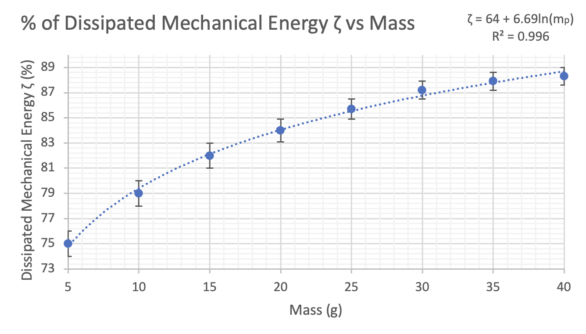

# Tuned Mass Damper Investigation
> IB Physics Higher Level Internal Assessment (IA) on combatting earthquakes with Tuned Mass Damper systems. Investigating the effect of mass on the dissipation of mechanical energy.

#### Check Final_Physics_IA.pdf for the final report

Oscillation of structure (skyscraper) example graph (acceleration versus time).

  

Mass of Tuned Mass Damper versus % of dissipated mechanical energy. 

  

## Technologies
* Raspberry Pi 3b+ for data extraction from accelerometer attached to oscillating structure
* SenseHat package for sensor data extraction
* MatPlotLib for plotting
* LaTeX final report (submitted to IB for class of 2022!)
